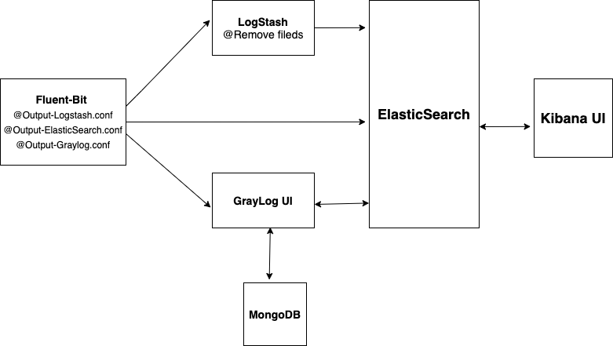
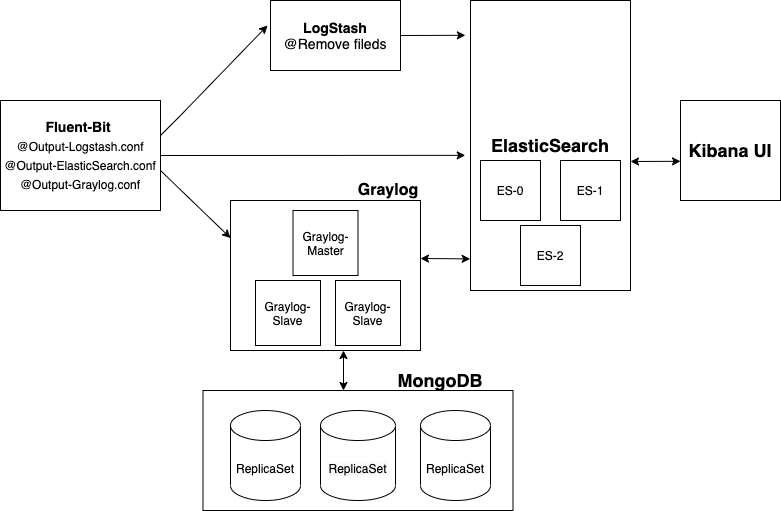

# Logging for Kubernetes

`NOTE:` For logs storage, used emptyDir as a storage. it's recommend to store as persistence volume

Run below playbook to install Fluent-Bit, ElasticSearch, LogStash, Graylog, Kibana

## Dev Logging
```
kubectl apply -f logging-all-in-one.yaml
```

`logging-all-in-one.yaml` represents below archtechture 




## Prod Logging

`prod-logging.yaml` represents below architecture 




If you want to explore individual stack, please go through below steps 


## [Kubernetes Logging with Graylog](https://github.com/angudadevops/k8s_addons/tree/master/logging/graylog)

Deploy Logging stack end to end with one yaml. Please run the below command to install Graylog stack

   Please make sure to have at least 2 CPU for this setup

   Below yaml helps you to setup fluent-bit, GrayLog, Elasticsearch stack, Mongo DB.
   ```
   kubectl apply -f graylog/*
   ```


## [Logging with EFK on Kubernetes](https://github.com/angudadevops/k8s_addons/tree/master/logging/EFK)

Kubernetes logging with EFK

Deploy Logging stack end to end with one yaml. Please run the below command to install EFK stack 

   Please make sure to have at least 2 CPU for this setup
 
   Below yaml helps you to setup fluent-bit, Kibana, Elasticsearch stack. 
   ```
   kubectl apply -f EFK/*
   ``` 

## [ELK logging on Kuberenetes](https://github.com/angudadevops/k8s_addons/tree/master/logging/ELK)

Deploy Logging stack end to end with one yaml. Please run the below command to install ELK stack

   Please make sure to have at least 2 CPU for this setup

   Below yaml helps you to setup fluent-bit, LogStash, Kibana, Elasticsearch stack.
   ```
   kubectl apply -f ELK/*
   ```

## Cleanup

To delte the logging components, run the below command
  ```
  kubectl delete ns logging
  ```

## Access
Access Kibana with nodePort as 31113 like below 

  ```
  Example: 
   http://10.104.67.161:31113
  ```
Access Graylog with nodePort as 31050 like below

 ```
  Example:
   http://10.104.67.161:31050
  ```
