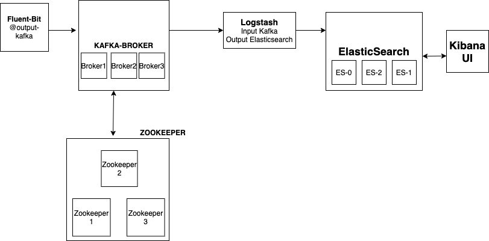

# Logging with Kafka on Kubernetes

`NOTE:` For logs storage, used emptyDir as a storage. it's recommend to store as persistence volume

Run below playbook to install Fluent-Bit, ElasticSearch, LogStash, Kafka Broker, Zookeeper, Kibana

## Dev Logging

```
kubectl apply -f kafka-dev.yaml
```

`kafka-dev.yaml` represents below archtechture 


## Prod Logging

```
kubectl apply -f kafka-prod.yaml
```

`kafka-prod.yaml` represents below architecture 




## Cleanup

To delte the logging components, run the below command
  ```
  kubectl delete ns logging
  ```

## Access
Access Kibana with nodePort as 31112 like below 

  ```
  Example: 
   http://10.104.67.161:31112
  ```
